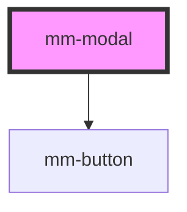

# mm-modal

<!-- Auto Generated Below -->

## Properties

| Property     | Attribute    | Description | Type      | Default       |
| ------------ | ------------ | ----------- | --------- | ------------- |
| `appearence` | `appearence` |             | `string`  | `undefined`   |
| `buttons`    | `buttons`    |             | `string`  | `undefined`   |
| `closeIcon`  | `close-icon` |             | `string`  | `'close.svg'` |
| `header`     | `header`     |             | `string`  | `undefined`   |
| `isopen`     | `isopen`     |             | `boolean` | `undefined`   |

## Events

| Event    | Description | Type               |
| -------- | ----------- | ------------------ |
| `action` |             | `CustomEvent<any>` |

## Dependencies

### Depends on

- [mm-button](../mm-button)

### Graph

----------------------------------------------

*Built with [StencilJS](https://stenciljs.com/)*
